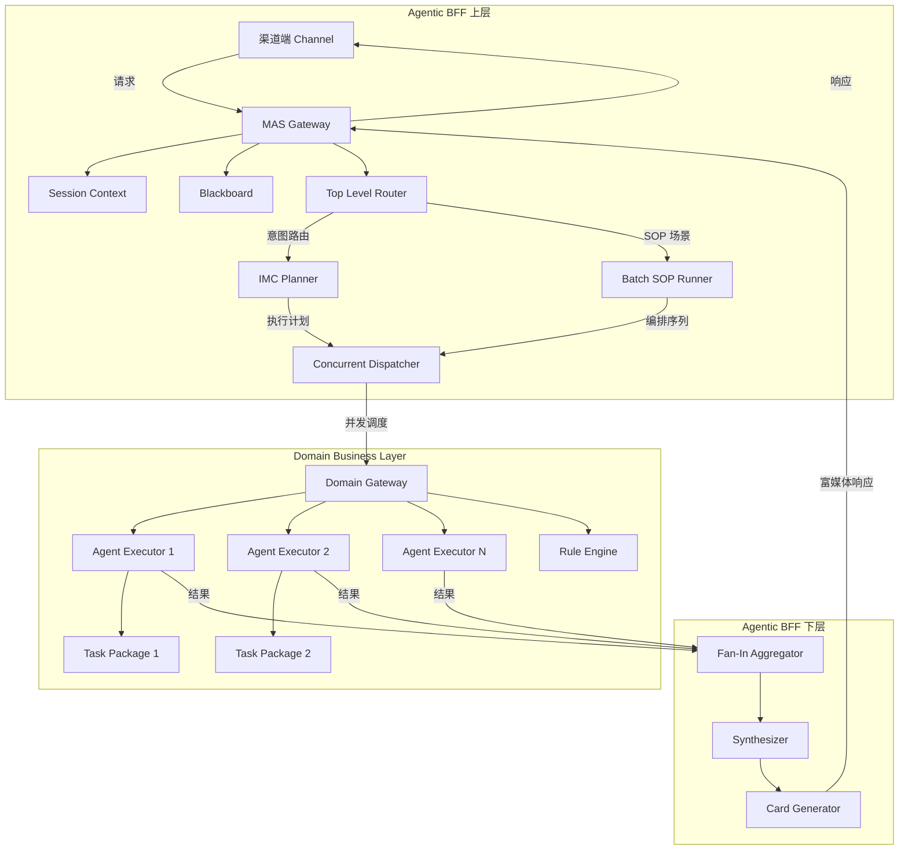
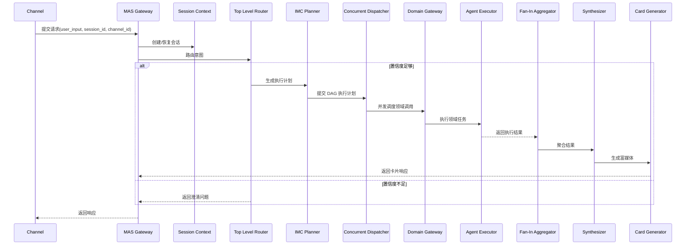
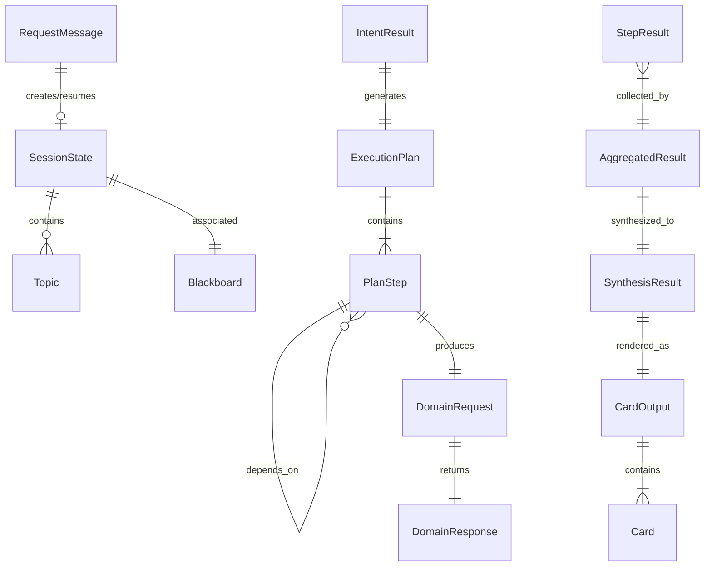
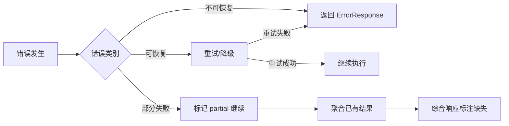

# Design Document: Agentic BFF SDK

## Overview

本设计文档描述 Agentic BFF SDK 的技术架构与实现方案。该 SDK 基于 Python + LangChain/LangGraph 构建，采用多智能体系统（MAS）架构，为上层渠道端提供统一的智能体编排与调度能力。

### 设计目标

- 提供抽象、可复用的多智能体编排框架
- 基于 LangGraph 的有向图（DAG）实现并发调度与状态管理
- 通过 Python 抽象基类和插件机制支持业务扩展
- 支持同步/异步两种执行模式
- 提供完整的类型注解，确保开发体验

### 技术选型

| 组件 | 技术方案 | 理由 |
|------|---------|------|
| 核心框架 | LangChain + LangGraph | LangGraph 原生支持有向图编排、状态管理和多智能体协作 |
| Agent 执行 | LangChain ReAct Agent | 成熟的推理-行动交替模式，支持自定义工具注册 |
| 并发调度 | Python asyncio + LangGraph | asyncio 提供原生协程并发，LangGraph 管理 DAG 执行流 |
| 状态管理 | LangGraph State + 自定义 Blackboard | LangGraph 内置状态传递，Blackboard 扩展跨 Agent 共享 |
| 配置管理 | Pydantic + YAML/JSON | Pydantic 提供类型安全的配置验证 |
| 序列化 | Pydantic Models + JSON | 统一的数据模型序列化/反序列化 |
| 规则引擎集成 | HTTP Client (httpx) | 异步 HTTP 调用 Java 规则引擎 |

### 研究发现

1. **LangGraph 多智能体编排**：LangGraph 将每个 Agent 建模为图中的节点，通过边定义控制流，天然支持 DAG 并发执行和条件路由。这与本 SDK 的 Concurrent_Dispatcher 需求高度契合。([来源](https://blog.langchain.dev/langgraph-multi-agent-workflows/))

2. **ReAct 模式**：LangChain 提供 `create_react_agent` 工厂函数，基于 Reasoning + Acting 交替循环实现工具调用。Agent_Executor 可直接基于此构建。([来源](https://api.python.langchain.com/en/latest/agents/langchain.agents.react.agent.create_react_agent.html))

3. **asyncio Fan-In 模式**：Python asyncio 的 `asyncio.gather` 和 `asyncio.wait` 原生支持并发任务聚合，配合 `asyncio.TaskGroup` 可实现超时控制和部分结果收集。([来源](https://docs.python.org/3/library/asyncio-task.html))

## Architecture

### 整体分层架构



### 请求处理流程




## Components and Interfaces

### 1. MAS Gateway (`MASGateway`)

全局入口组件，负责请求接收、会话管理、话题管理和异步任务管理。

```python
from abc import ABC, abstractmethod
from typing import Optional, List, Dict, Any
from pydantic import BaseModel
from enum import Enum

class RequestMessage(BaseModel):
    user_input: str
    session_id: str
    channel_id: str
    metadata: Dict[str, Any] = {}

class ResponseMessage(BaseModel):
    session_id: str
    content: Any  # Card or text
    task_id: Optional[str] = None
    is_async: bool = False
    error: Optional[ErrorResponse] = None

class ErrorResponse(BaseModel):
    code: str
    message: str
    details: Optional[Dict[str, Any]] = None

class TaskStatus(str, Enum):
    PENDING = "pending"
    RUNNING = "running"
    COMPLETED = "completed"
    FAILED = "failed"

class MASGateway(ABC):
    """全局 MAS 入口抽象基类"""

    @abstractmethod
    async def handle_request(self, request: RequestMessage) -> ResponseMessage:
        """处理同步请求"""
        ...

    @abstractmethod
    async def submit_async_task(self, request: RequestMessage, priority: int = 0) -> str:
        """提交异步任务，返回 task_id"""
        ...

    @abstractmethod
    async def get_task_status(self, task_id: str) -> TaskStatus:
        """查询异步任务状态"""
        ...

    @abstractmethod
    def register_plugin(self, plugin_type: str, plugin: Any) -> None:
        """注册自定义插件（路由器、执行器、生成器）"""
        ...
```

### 2. Session Context (`SessionContext`)

会话上下文管理，维护对话历史、用户画像和话题信息。

```python
class Topic(BaseModel):
    topic_id: str
    name: str
    status: str  # "active", "suspended", "closed"
    created_at: float
    metadata: Dict[str, Any] = {}

class SessionContext:
    """会话上下文管理"""

    async def get_or_create(self, session_id: str) -> "SessionState":
        """获取或创建会话状态"""
        ...

    async def save(self, session_id: str, state: "SessionState") -> None:
        """持久化会话状态"""
        ...

    async def cleanup_expired(self, idle_timeout_seconds: int) -> List[str]:
        """清理过期会话，返回被清理的 session_id 列表"""
        ...

class SessionState(BaseModel):
    session_id: str
    dialog_history: List[Dict[str, Any]]
    user_profile_summary: Optional[str] = None
    active_topics: List[Topic] = []
    created_at: float
    last_active_at: float
```

### 3. Blackboard (`Blackboard`)

线程安全的共享状态存储。

```python
import asyncio
from typing import Optional, Any

class Blackboard:
    """线程安全的黑板共享状态"""

    def __init__(self):
        self._store: Dict[str, Any] = {}
        self._access_times: Dict[str, float] = {}
        self._lock = asyncio.Lock()

    async def get(self, key: str) -> Optional[Any]:
        """读取键值"""
        ...

    async def set(self, key: str, value: Any) -> None:
        """写入键值"""
        ...

    async def delete(self, key: str) -> bool:
        """删除键值"""
        ...

    async def cleanup_expired(self, ttl_seconds: int) -> List[str]:
        """清理过期键值，返回被清理的 key 列表"""
        ...
```

### 4. Top Level Router (`TopLevelRouter`)

意图识别与路由。

```python
class IntentResult(BaseModel):
    intent_type: str
    confidence: float
    parameters: Dict[str, Any] = {}

class ClarificationQuestion(BaseModel):
    question: str
    candidates: List[IntentResult] = []

class RouterMode(str, Enum):
    GENERATE = "generate"
    CONFIRM = "confirm"

class TopLevelRouter(ABC):
    """顶层意图路由器抽象基类"""

    @abstractmethod
    async def route(
        self,
        user_input: str,
        session_state: SessionState,
        mode: RouterMode = RouterMode.GENERATE,
    ) -> IntentResult | ClarificationQuestion:
        """识别意图或生成澄清问题"""
        ...

    @abstractmethod
    def register_priority_rule(self, rule: Dict[str, Any]) -> None:
        """注册优先匹配规则"""
        ...

    @abstractmethod
    def register_fallback_handler(self, handler: Any) -> None:
        """注册兜底处理链路"""
        ...
```

### 5. IMC Planner (`IMCPlanner`)

基于 CoT 的一次性执行计划生成。

```python
class PlanStep(BaseModel):
    step_id: str
    domain: str
    action: str
    parameters: Dict[str, Any] = {}
    dependencies: List[str] = []  # step_ids this step depends on
    is_react_node: bool = False  # 是否为 ReAct 循环节点

class ExecutionPlan(BaseModel):
    plan_id: str
    intent: IntentResult
    steps: List[PlanStep]
    created_at: float
    timeout_seconds: Optional[float] = None

class IMCPlanner(ABC):
    """一次开发完成器抽象基类"""

    @abstractmethod
    async def generate_plan(
        self,
        intent: IntentResult,
        session_state: SessionState,
        timeout_seconds: Optional[float] = None,
    ) -> ExecutionPlan:
        """基于 CoT 生成执行计划"""
        ...

    @abstractmethod
    async def persist_plan(self, plan: ExecutionPlan) -> str:
        """持久化执行计划（离线场景）"""
        ...
```

### 6. Batch SOP Runner (`BatchSOPRunner`)

跨领域合并执行器。

```python
class InteractionScene(str, Enum):
    PHONE = "phone"
    FACE_TO_FACE = "face_to_face"
    ONLINE = "online"

class SOPDefinition(BaseModel):
    sop_id: str
    name: str
    steps: List[Dict[str, Any]]
    exception_policies: Dict[str, str]  # error_type -> action (retry/skip/rollback)
    dialog_templates: Dict[InteractionScene, str]

class BatchSOPRunner(ABC):
    """跨领域合并执行器抽象基类"""

    @abstractmethod
    async def execute(
        self,
        plan: ExecutionPlan,
        sop: SOPDefinition,
        scene: InteractionScene,
        blackboard: Blackboard,
    ) -> List[Dict[str, Any]]:
        """按 SOP 编排执行"""
        ...
```

### 7. Concurrent Dispatcher (`ConcurrentDispatcher`)

DAG 并发调度引擎。

```python
class StepStatus(str, Enum):
    PENDING = "pending"
    RUNNING = "running"
    COMPLETED = "completed"
    FAILED = "failed"
    TIMEOUT = "timeout"

class StepResult(BaseModel):
    step_id: str
    status: StepStatus
    result: Optional[Any] = None
    error: Optional[str] = None
    duration_ms: float = 0

class StatusCallback(ABC):
    @abstractmethod
    async def on_status_change(self, step_id: str, old_status: StepStatus, new_status: StepStatus) -> None:
        ...

class ConcurrentDispatcher:
    """DAG 并发调度引擎"""

    async def dispatch(
        self,
        plan: ExecutionPlan,
        domain_gateway: "DomainGateway",
        blackboard: Blackboard,
        step_timeout_seconds: float = 30.0,
        callback: Optional[StatusCallback] = None,
    ) -> List[StepResult]:
        """解析 DAG 并发执行步骤"""
        ...

    def validate_dag(self, plan: ExecutionPlan) -> Optional[List[str]]:
        """验证 DAG 无循环依赖，返回循环路径或 None"""
        ...
```

### 8. Domain Gateway (`DomainGateway`)

统一领域网关。

```python
class DomainRequest(BaseModel):
    domain: str
    action: str
    parameters: Dict[str, Any] = {}
    request_id: str

class DomainResponse(BaseModel):
    request_id: str
    domain: str
    success: bool
    data: Optional[Any] = None
    error: Optional[str] = None

class DomainGateway(ABC):
    """领域网关抽象基类"""

    @abstractmethod
    async def invoke(self, request: DomainRequest) -> DomainResponse:
        """路由并执行领域调用"""
        ...

    @abstractmethod
    def register_task_package(self, domain: str, task_package: "TaskPackage") -> None:
        """注册领域任务包"""
        ...

    @abstractmethod
    async def invoke_rule_engine(self, rule_set_id: str, params: Dict[str, Any]) -> Any:
        """调用规则引擎"""
        ...
```

### 9. Agent Executor (`AgentExecutor`)

基于 ReAct 模式的领域任务执行代理。

```python
from langchain_core.tools import BaseTool

class ToolDefinition(BaseModel):
    name: str
    description: str
    input_schema: Dict[str, Any]

class AgentExecutorConfig(BaseModel):
    max_reasoning_steps: int = 10
    tools: List[ToolDefinition] = []

class AgentExecutor(ABC):
    """Agent 执行代理抽象基类"""

    @abstractmethod
    async def execute(
        self,
        action: str,
        parameters: Dict[str, Any],
        blackboard: Blackboard,
        config: AgentExecutorConfig,
    ) -> Any:
        """基于 ReAct 模式执行领域任务"""
        ...

    @abstractmethod
    def register_tool(self, tool: BaseTool) -> None:
        """注册自定义工具"""
        ...
```

### 10. Fan-In Aggregator (`FanInAggregator`)

异步结果聚合器。

```python
class AggregatedResult(BaseModel):
    results: List[StepResult]
    missing_steps: List[str] = []
    is_partial: bool = False

class FanInAggregator:
    """Async Fan-In 结果聚合器"""

    async def aggregate(
        self,
        step_results: List[StepResult],
        expected_steps: List[str],
        wait_timeout_seconds: float = 60.0,
    ) -> AggregatedResult:
        """聚合多步执行结果"""
        ...
```

### 11. Synthesizer (`Synthesizer`)

结果综合与决策。

```python
class SynthesisResult(BaseModel):
    text_response: str
    structured_data: Optional[Dict[str, Any]] = None
    requires_confirmation: bool = False
    confirmation_actions: List[Dict[str, Any]] = []
    quality_score: float = 0.0

class Synthesizer(ABC):
    """结果综合器抽象基类"""

    @abstractmethod
    async def synthesize(
        self,
        aggregated: AggregatedResult,
        session_state: SessionState,
        quality_threshold: float = 0.7,
    ) -> SynthesisResult:
        """综合多领域结果生成连贯响应"""
        ...
```

### 12. Card Generator (`CardGenerator`)

富媒体卡片生成。

```python
class CardType(str, Enum):
    TEXT = "text"
    TABLE = "table"
    CHART = "chart"
    ACTION_BUTTON = "action_button"
    CONFIRMATION = "confirmation"

class Card(BaseModel):
    card_type: CardType
    title: Optional[str] = None
    content: Dict[str, Any]
    actions: List[Dict[str, Any]] = []

class CardOutput(BaseModel):
    cards: List[Card]
    raw_text: Optional[str] = None

class CardGenerator(ABC):
    """富媒体卡片生成器抽象基类"""

    @abstractmethod
    async def generate(
        self,
        synthesis: SynthesisResult,
        channel_capabilities: Dict[str, Any],
    ) -> CardOutput:
        """生成富媒体卡片"""
        ...
```


## Data Models

### 核心数据模型关系



### 配置模型

```python
class SDKConfig(BaseModel):
    """SDK 全局配置"""
    # 会话管理
    session_idle_timeout_seconds: int = 1800  # 30 分钟
    max_dialog_history_turns: int = 50
    dialog_summary_threshold: int = 30

    # 意图路由
    intent_confidence_threshold: float = 0.7
    intent_ambiguity_range: float = 0.1

    # 执行控制
    plan_generation_timeout_seconds: float = 30.0
    step_execution_timeout_seconds: float = 60.0
    max_reasoning_steps: int = 10
    fan_in_wait_timeout_seconds: float = 120.0

    # Blackboard
    blackboard_key_ttl_seconds: int = 3600  # 1 小时

    # 异步任务
    async_task_callback_url: Optional[str] = None
    async_task_callback_type: str = "webhook"  # webhook | mq

    # 综合决策
    synthesis_quality_threshold: float = 0.7
    max_cross_llm_loops: int = 3

    # 规则引擎
    rule_engine_base_url: Optional[str] = None
    rule_engine_timeout_seconds: float = 10.0
    rule_engine_cache_ttl_seconds: int = 300

class ChannelAdapterConfig(BaseModel):
    """渠道适配器配置"""
    channel_id: str
    channel_name: str
    capabilities: Dict[str, Any] = {}  # 渠道渲染能力描述
    adapter_class: str  # 适配器类的完整路径

class TaskPackageConfig(BaseModel):
    """领域任务包配置"""
    domain: str
    name: str
    tools: List[ToolDefinition] = []
    protocol: str = "http"  # http | grpc
    base_url: str
    timeout_seconds: float = 30.0

class OrchestrationConfig(BaseModel):
    """编排流程配置（YAML/JSON 声明式）"""
    sdk: SDKConfig = SDKConfig()
    channels: List[ChannelAdapterConfig] = []
    task_packages: List[TaskPackageConfig] = []
    priority_rules: List[Dict[str, Any]] = []
    sop_definitions: List[SOPDefinition] = []
```

### 序列化约定

所有数据模型基于 Pydantic BaseModel，支持：
- `model_dump()` / `model_dump_json()` 序列化为 dict/JSON
- `model_validate()` / `model_validate_json()` 从 dict/JSON 反序列化
- JSON Schema 自动生成（用于 Card_Generator 输出验证）

### 持久化策略

| 数据类型 | 存储后端 | 说明 |
|---------|---------|------|
| SessionState | 可配置（Redis/内存/数据库） | 通过 StorageBackend 抽象接口 |
| ExecutionPlan | 可配置（数据库/文件） | 离线场景持久化 |
| Blackboard 数据 | 内存（默认）/ Redis | 会话级生命周期 |
| 任务状态 | 可配置（Redis/数据库） | 异步任务追踪 |
| 审计日志 | 可配置（日志文件/数据库） | Domain_Gateway 调用记录 |


## Correctness Properties

*A property is a characteristic or behavior that should hold true across all valid executions of a system — essentially, a formal statement about what the system should do. Properties serve as the bridge between human-readable specifications and machine-verifiable correctness guarantees.*

### Property 1: Session 状态持久化 Round-Trip

*For any* valid `SessionState`（包含任意对话历史、用户画像摘要和活跃话题），将其保存到存储后端后再加载，应产生与原始状态等价的 `SessionState` 实例。

**Validates: Requirements 1.2, 2.1, 2.4**

### Property 2: 请求验证 — 缺失标识返回错误

*For any* `RequestMessage`，若其 `session_id` 或 `channel_id` 为空字符串或缺失，`MAS_Gateway` 应返回包含错误码和错误描述的 `ErrorResponse`，且不创建任何 `SessionContext`。

**Validates: Requirements 1.4**

### Property 3: 会话过期清理

*For any* `SessionState` 集合，调用 `cleanup_expired(idle_timeout)` 后，所有 `last_active_at` 距当前时间超过 `idle_timeout` 的会话应被移除，而未超时的会话应被保留。

**Validates: Requirements 1.5**

### Property 4: 话题管理一致性

*For any* 话题操作序列（创建、切换、关闭），执行后的话题列表应满足：已创建的话题存在于列表中，已关闭的话题状态为 "closed"，当前活跃话题最多只有一个。

**Validates: Requirements 1.3**

### Property 5: Blackboard 键值 Round-Trip

*For any* 键值对 `(key, value)`，对 `Blackboard` 执行 `set(key, value)` 后立即执行 `get(key)`，应返回与 `value` 等价的结果。

**Validates: Requirements 2.2, 5.6, 13.3**

### Property 6: Blackboard 过期清理

*For any* Blackboard 中的键值集合，调用 `cleanup_expired(ttl)` 后，所有最后访问时间超过 `ttl` 的键值应被移除，未超过的应被保留。

**Validates: Requirements 2.5**

### Property 7: 对话历史压缩后长度不超限

*For any* 对话历史，当轮次超过配置的 `max_dialog_history_turns` 时，压缩后的对话历史长度应 ≤ `max_dialog_history_turns`，且最近的对话轮次应被完整保留。

**Validates: Requirements 2.3**

### Property 8: 低置信度意图触发澄清

*For any* 意图识别结果，若最高置信度低于配置的 `intent_confidence_threshold`，`TopLevelRouter` 应返回 `ClarificationQuestion` 而非 `IntentResult`。

**Validates: Requirements 3.3**

### Property 9: 优先匹配规则优先生效

*For any* 用户输入，若匹配了已注册的优先匹配规则，`TopLevelRouter` 应返回该规则对应的意图，无论 LLM 的识别结果如何。

**Validates: Requirements 3.4**

### Property 10: 歧义意图返回候选列表

*For any* 意图识别结果集合，若前两个候选意图的置信度差值在配置的 `intent_ambiguity_range` 内，`TopLevelRouter` 应返回包含候选列表的 `ClarificationQuestion`。

**Validates: Requirements 3.5**

### Property 11: 无匹配意图路由到兜底链路

*For any* 用户输入，若无法匹配任何已注册意图，`TopLevelRouter` 应将请求路由到已注册的兜底处理链路。

**Validates: Requirements 3.6**

### Property 12: 执行计划结构有效性

*For any* `ExecutionPlan`，其中每个 `PlanStep` 应具有非空的 `domain` 和 `action`，且所有 `dependencies` 中引用的 `step_id` 应存在于同一计划的步骤列表中。

**Validates: Requirements 4.2, 4.6**

### Property 13: 执行计划持久化 Round-Trip

*For any* 有效的 `ExecutionPlan`，持久化后再加载应产生与原始计划等价的实例。

**Validates: Requirements 4.5**

### Property 14: SOP 异常处理策略正确执行

*For any* 领域调用失败和已配置的异常处理策略（retry/skip/rollback），`BatchSOPRunner` 应执行与策略匹配的恢复操作。

**Validates: Requirements 5.5**

### Property 15: 交互场景对话模板匹配

*For any* `InteractionScene`，`BatchSOPRunner` 应选择与该场景对应的对话模板。

**Validates: Requirements 5.2**

### Property 16: DAG 循环依赖检测

*For any* `ExecutionPlan`，若步骤间存在循环依赖，`validate_dag` 应返回包含循环路径的列表；若无循环依赖，应返回 `None`。

**Validates: Requirements 6.6**

### Property 17: DAG 并发调度正确性

*For any* 有效的 DAG 执行计划，每批次调度的步骤集合中，每个步骤的所有依赖步骤应已处于 `COMPLETED` 状态。

**Validates: Requirements 6.1, 6.2**

### Property 18: 步骤状态转换有效性

*For any* 步骤执行过程，状态转换应遵循有效路径：`PENDING → RUNNING → {COMPLETED, FAILED, TIMEOUT}`，不允许跳过中间状态或逆向转换。

**Validates: Requirements 6.5**

### Property 19: 超时步骤标记与继续执行

*For any* 超时的执行步骤，其状态应被标记为 `TIMEOUT`，且不依赖该步骤的其余步骤应继续正常执行。

**Validates: Requirements 6.4**

### Property 20: 领域路由正确性

*For any* `DomainRequest`，若其 `domain` 已注册对应的 `TaskPackage`，请求应被路由到该 `TaskPackage`；若未注册，应返回服务不可用错误。

**Validates: Requirements 7.1, 7.2, 7.3, 7.5**

### Property 21: 工具输入参数验证

*For any* 工具调用请求，若输入参数符合工具定义的 `input_schema`，验证应通过；若不符合，验证应拒绝并返回错误。

**Validates: Requirements 8.4**

### Property 22: Agent 推理步数上限

*For any* `AgentExecutor` 执行过程，推理步数应不超过配置的 `max_reasoning_steps`。

**Validates: Requirements 8.6**

### Property 23: 结果聚合完整性

*For any* 步骤结果集合，若所有预期步骤均已完成，`AggregatedResult` 应包含所有结果且 `is_partial=False`、`missing_steps` 为空；若部分步骤缺失，`is_partial=True` 且 `missing_steps` 列出缺失的 `step_id`。

**Validates: Requirements 9.1, 9.2, 9.3**

### Property 24: 卡片输出 JSON Schema 合规

*For any* 生成的 `CardOutput`，序列化为 JSON 后应通过预定义的 JSON Schema 验证。

**Validates: Requirements 10.4**

### Property 25: 渠道能力适配

*For any* 渠道能力描述和 `SynthesisResult`，生成的卡片应仅使用该渠道支持的卡片类型。

**Validates: Requirements 10.3**

### Property 26: 确认操作生成交互卡片

*For any* `SynthesisResult`，若 `requires_confirmation=True`，生成的 `CardOutput` 应包含至少一个 `CONFIRMATION` 类型的卡片，且该卡片包含操作按钮。

**Validates: Requirements 10.5**

### Property 27: 异步任务提交与查询 Round-Trip

*For any* 异步任务提交请求，应返回非空的 `task_id`，且通过该 `task_id` 查询应返回有效的 `TaskStatus`。

**Validates: Requirements 11.1, 11.3**

### Property 28: 任务优先级调度顺序

*For any* 待执行任务集合，高优先级任务应优先于低优先级任务获得执行资源。

**Validates: Requirements 11.5**

### Property 29: 编排配置 Round-Trip

*For any* 有效的 `OrchestrationConfig`，序列化为 YAML/JSON 后再反序列化应产生与原始配置等价的实例。

**Validates: Requirements 12.2**

### Property 30: 规则引擎降级策略

*For any* 规则引擎调用超时或错误，若配置了降级策略，`AgentExecutor` 应返回配置的默认值；若未配置降级策略，应抛出异常。

**Validates: Requirements 13.4**

### Property 31: 规则元数据缓存有效性

*For any* 规则元数据查询，首次查询后在 TTL 内的后续查询应返回缓存数据而不触发对 Rule_Engine 的实际调用。

**Validates: Requirements 13.5**


## Error Handling

### 错误分类

| 错误类别 | 错误码前缀 | 说明 | 处理策略 |
|---------|-----------|------|---------|
| 请求验证错误 | `REQ_` | 缺失字段、格式错误 | 立即返回 ErrorResponse |
| 会话错误 | `SESSION_` | 会话不存在、已过期 | 创建新会话或返回错误 |
| 意图路由错误 | `ROUTE_` | 无法识别意图 | 路由到兜底链路 |
| 计划生成错误 | `PLAN_` | CoT 超时、生成失败 | 返回错误或降级为简单响应 |
| 调度错误 | `DISPATCH_` | DAG 循环、步骤超时 | 拒绝执行或跳过超时步骤 |
| 领域调用错误 | `DOMAIN_` | 微服务不可用、调用失败 | 重试/跳过/回滚（按 SOP 策略） |
| 规则引擎错误 | `RULE_` | 调用超时、计算错误 | 降级返回默认值或抛出异常 |
| 聚合错误 | `AGG_` | 部分结果缺失 | 标记为 partial，继续综合 |
| 综合错误 | `SYNTH_` | LLM 质量不达标 | 触发交叉 LLM 回路重试 |
| 系统错误 | `SYS_` | 内部异常 | 记录日志，返回通用错误 |

### 错误传播机制



### 关键错误处理规则

1. **请求层**：所有入口请求必须经过 Pydantic 验证，无效请求立即返回 `ErrorResponse`
2. **调度层**：单步骤失败不影响无依赖的其他步骤执行；依赖失败步骤的下游步骤标记为 `FAILED`
3. **领域层**：按 SOP 定义的异常策略处理（retry 最多 3 次，skip 记录日志，rollback 回滚已执行步骤）
4. **聚合层**：超过等待时间后，以已收集的部分结果继续综合，在响应中标注缺失部分
5. **综合层**：质量不达标时触发交叉 LLM 回路，最多重试 `max_cross_llm_loops` 次
6. **异步任务**：失败任务记录失败原因，通过回调通知调用方，支持手动重试

## Testing Strategy

### 测试分层

```
┌─────────────────────────────────────┐
│         E2E Tests (少量)             │
│   完整请求流程端到端验证              │
├─────────────────────────────────────┤
│       Integration Tests (适量)       │
│   组件间交互、LLM 集成、外部服务      │
├─────────────────────────────────────┤
│     Property-Based Tests (核心)      │
│   31 个正确性属性的自动化验证          │
├─────────────────────────────────────┤
│       Unit Tests (基础)              │
│   具体示例、边界条件、错误处理         │
└─────────────────────────────────────┘
```

### Property-Based Testing 配置

- **测试框架**：[Hypothesis](https://hypothesis.readthedocs.io/) — Python 最成熟的 PBT 库
- **最小迭代次数**：每个属性测试 100 次
- **标签格式**：`Feature: agentic-bff-sdk, Property {number}: {property_text}`

#### PBT 覆盖的核心属性

| 属性编号 | 属性名称 | 测试模式 |
|---------|---------|---------|
| 1 | Session 状态 Round-Trip | Round-Trip |
| 2 | 请求验证 | Error Condition |
| 3 | 会话过期清理 | Invariant |
| 4 | 话题管理一致性 | Invariant |
| 5 | Blackboard 键值 Round-Trip | Round-Trip |
| 6 | Blackboard 过期清理 | Invariant |
| 7 | 对话历史压缩后长度不超限 | Invariant |
| 8-11 | 意图路由决策 | Metamorphic |
| 12 | 执行计划结构有效性 | Invariant |
| 13 | 执行计划 Round-Trip | Round-Trip |
| 14 | SOP 异常处理策略 | Metamorphic |
| 16 | DAG 循环依赖检测 | Invariant |
| 17 | DAG 并发调度正确性 | Invariant |
| 18 | 步骤状态转换有效性 | Invariant |
| 20 | 领域路由正确性 | Metamorphic |
| 21 | 工具输入参数验证 | Error Condition |
| 23 | 结果聚合完整性 | Invariant |
| 24 | 卡片输出 Schema 合规 | Invariant |
| 25-26 | 卡片生成适配 | Metamorphic |
| 27 | 异步任务 Round-Trip | Round-Trip |
| 29 | 编排配置 Round-Trip | Round-Trip |
| 30 | 规则引擎降级策略 | Error Condition |
| 31 | 规则元数据缓存 | Idempotence |

#### Hypothesis 策略示例

```python
from hypothesis import given, settings, strategies as st

# 生成随机 SessionState
session_state_strategy = st.builds(
    SessionState,
    session_id=st.text(min_size=1, max_size=64),
    dialog_history=st.lists(st.dictionaries(st.text(), st.text()), max_size=100),
    user_profile_summary=st.one_of(st.none(), st.text(max_size=500)),
    active_topics=st.lists(st.builds(Topic, ...), max_size=10),
    created_at=st.floats(min_value=0, max_value=1e12),
    last_active_at=st.floats(min_value=0, max_value=1e12),
)

# Property 1: Session 状态 Round-Trip
# Feature: agentic-bff-sdk, Property 1: Session 状态持久化 Round-Trip
@given(state=session_state_strategy)
@settings(max_examples=100)
def test_session_state_round_trip(state):
    storage = InMemoryStorage()
    storage.save(state.session_id, state)
    loaded = storage.load(state.session_id)
    assert loaded == state
```

### Unit Tests 覆盖范围

- **具体示例**：各组件的典型使用场景（Req 3.1, 3.2, 4.1, 7.4, 10.2）
- **边界条件**：空输入、最大长度、零超时等
- **错误处理**：各类错误码的正确返回
- **LLM 集成**：使用 Mock LLM 验证 ReAct 循环、CoT 推理、综合决策

### Integration Tests 覆盖范围

- **LLM 集成**：意图识别准确性（Req 3.1）、CoT 计划生成（Req 4.1）、结果综合（Req 9.4, 9.5）
- **外部服务**：规则引擎调用（Req 13.2）、回调通知（Req 11.2, 11.4）
- **流式处理**：并发步骤流式合并（Req 6.3）
- **端到端流程**：完整请求从入口到富媒体响应的全链路

### 测试工具链

| 工具 | 用途 |
|------|------|
| pytest | 测试运行器 |
| hypothesis | Property-Based Testing |
| pytest-asyncio | 异步测试支持 |
| unittest.mock / pytest-mock | Mock LLM 和外部服务 |
| pydantic | 数据模型验证 |
| jsonschema | Card 输出 Schema 验证 |

