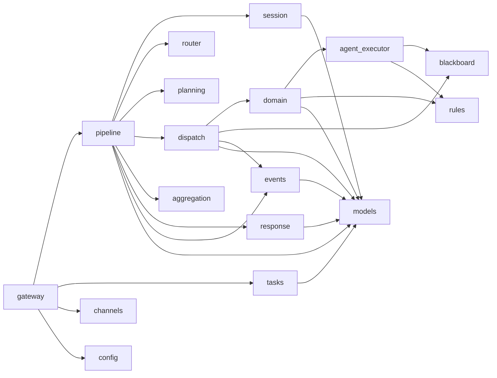
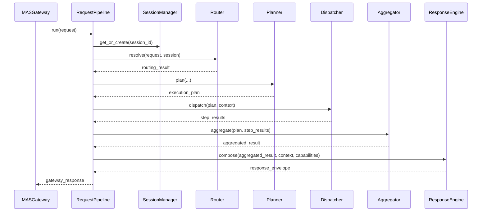
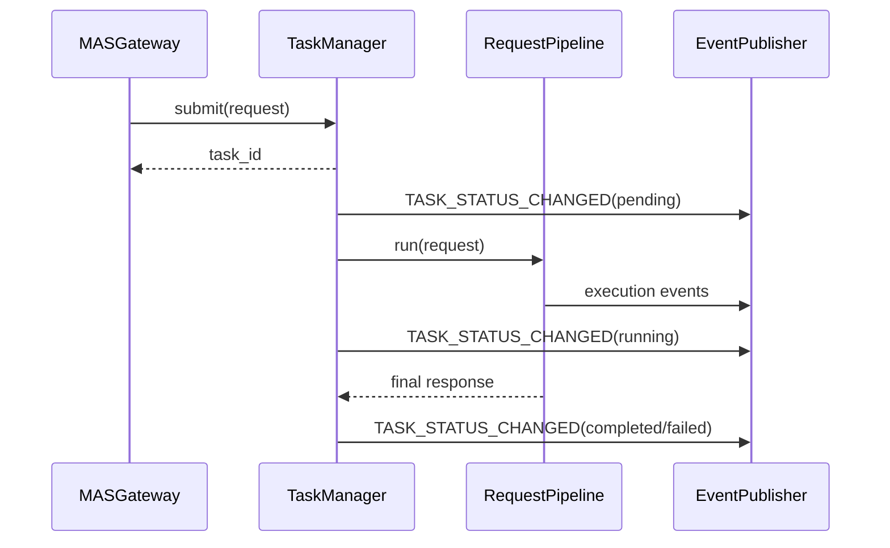

# Agentic BFF SDK 模块级详细设计文档

## 1. 文档目标

本文档基于重构方案，进一步细化 Agentic BFF SDK 的模块级设计，作为后续编码实现、测试设计和评审的直接依据。

本文档重点说明：

- 模块职责与边界
- 模块之间的依赖关系
- 输入输出模型
- 主流程与关键子流程
- 错误处理策略
- 扩展点与测试建议

本文档遵循 Python SDK 开发规范：

- Python 3.10+
- 对外接口显式类型注解
- 公共协议稳定
- 模块职责单一
- Pydantic 模型用于协议层数据定义

## 2. 模块总览

建议按如下模块组织源码：

- `gateway.py`
- `pipeline.py`
- `tasks.py`
- `session.py`
- `blackboard.py`
- `router.py`
- `planning.py`
- `dispatch.py`
- `domain.py`
- `agent_executor.py`
- `rules.py`
- `aggregation.py`
- `response.py`
- `channels.py`
- `events.py`
- `config.py`
- `errors.py`
- `models.py`

### 2.1 模块收敛说明

为避免 SDK 模块碎片化，本设计采用“职责分层，源码适度收敛”的策略。

不单独拆成顶层模块的对象：

- `CallbackNotifier`：内聚到 `tasks.py`
- `TopicManager`、`DialogCompressor`：内聚到 `session.py`
- `PlanValidator`：内聚到 `planning.py`
- `StatusTracker`、`AsyncioRuntime`、`GraphRuntimeAdapter`：内聚到 `dispatch.py`
- `RuleMetadataCache`、`RuleResultCache`：内聚到 `rules.py`
- `ToolRegistry`、`ToolInputValidator`：内聚到 `agent_executor.py`

合并后的模块：

- `decision.py`、`synthesis.py`、`cards.py` 合并为 `response.py`

这样处理后，职责仍然清晰，但源码模块数更适合 Python SDK 长期维护。

## 3. 模块依赖关系



## 4. 公共设计约束

### 4.1 作用域模型

系统状态分为三层：

- `SessionState`: 会话级长期状态
- `RequestContext`: 单次请求上下文
- `ExecutionContext`: 单次执行过程共享状态

### 4.2 执行模型

统一执行输入为 `ExecutionPlan`，统一执行输出为：

- 过程事件：`ExecutionEvent`
- 步骤结果：`StepResult`
- 汇总结果：`AggregatedResult`
- 决策结果：`DecisionOutcome`
- 最终响应：`ResponseEnvelope`

### 4.3 错误模型

错误分两类：

- 业务可恢复错误：通过 `ErrorResponse` 向上返回
- 系统不可恢复错误：记录日志并转为 `INTERNAL_ERROR`

### 4.4 线程与并发模型

- 会话存储由 `SessionStore` 保证一致性
- 黑板由 `Blackboard` 提供并发安全访问
- `Dispatcher` 负责 DAG 并发执行，不允许领域模块自行打乱依赖图

## 5. 模块详细设计

## 5.1 `models.py`

### 职责

定义 SDK 公共数据模型，供各模块共享。

### 包含内容

- 请求与响应模型
- 会话模型
- 执行计划模型
- 步骤执行模型
- 聚合与决策模型
- 卡片模型
- 事件模型
- 任务快照模型

### 设计约束

- 不写业务逻辑
- 仅保留必要校验
- 避免与具体运行时强耦合

### 关键模型

```python
from enum import Enum

from pydantic import BaseModel, Field


class ErrorCode(str, Enum):
    INVALID_REQUEST = "invalid_request"
    SESSION_NOT_FOUND = "session_not_found"
    INTENT_NOT_RECOGNIZED = "intent_not_recognized"
    PLAN_VALIDATION_FAILED = "plan_validation_failed"
    DOMAIN_UNAVAILABLE = "domain_unavailable"
    RULE_ENGINE_ERROR = "rule_engine_error"
    INTERNAL_ERROR = "internal_error"


class ErrorResponse(BaseModel):
    code: ErrorCode
    message: str
    details: dict[str, object] = Field(default_factory=dict)
```

### 测试建议

- 模型序列化/反序列化 round-trip
- 枚举字段合法性校验
- `ExecutionPlan` 依赖校验

## 5.2 `errors.py`

### 职责

定义稳定异常体系，屏蔽内部实现差异。

### 异常层次

```python
class SDKError(Exception):
    code: ErrorCode


class ValidationError(SDKError):
    ...


class RoutingError(SDKError):
    ...


class PlanningError(SDKError):
    ...


class DispatchError(SDKError):
    ...


class DomainExecutionError(SDKError):
    ...


class RuleEngineError(SDKError):
    ...
```

### 设计说明

- 模块内部可以抛细分异常
- 网关层统一映射为 `ErrorResponse`
- 不暴露底层第三方异常给 SDK 用户

## 5.3 `config.py`

### 职责

定义 SDK 配置模型与配置加载能力。

### 子配置

- `RuntimeConfig`
- `RuleEngineConfig`
- `ChannelConfig`
- `DomainConfig`
- `ObservabilityConfig`
- `SDKConfig`

### 接口草案

```python
from pathlib import Path

from pydantic import BaseModel, Field


class SDKConfig(BaseModel):
    runtime: "RuntimeConfig" = Field(default_factory=lambda: RuntimeConfig())
    rule_engine: "RuleEngineConfig" = Field(default_factory=lambda: RuleEngineConfig())
    channels: list["ChannelConfig"] = Field(default_factory=list)
    domains: list["DomainConfig"] = Field(default_factory=list)

    @classmethod
    def from_file(cls, path: str | Path) -> "SDKConfig":
        ...
```

### 关键约束

- 支持 YAML / JSON
- 不在配置对象中执行动态导入
- 类路径解析应放在工厂或装配层

### 测试建议

- 文件加载 round-trip
- 缺失字段默认值校验
- 非法配置字段校验

## 5.4 `channels.py`

### 职责

定义多渠道适配协议。

### 核心对象

- `ChannelAdapter`
- `ChannelCapabilities`

### 输入输出

- 输入：渠道原生请求对象
- 输出：`GatewayRequest`

### 接口草案

```python
from abc import ABC, abstractmethod


class ChannelAdapter(ABC):
    @abstractmethod
    async def adapt_inbound(self, payload: object) -> "GatewayRequest":
        ...

    @abstractmethod
    async def adapt_outbound(self, response: "ResponseEnvelope") -> object:
        ...

    @abstractmethod
    def get_capabilities(self) -> "ChannelCapabilities":
        ...
```

### 设计说明

- 渠道能力不通过松散 `metadata` 传递
- 每个渠道适配器必须声明能力上限
- 卡片生成器据此降级输出

### 扩展点

- Web 渠道
- App 渠道
- IM 渠道
- 电话/人工辅助渠道

## 5.5 `gateway.py`

### 职责

`MASGateway` 是 SDK 外部统一入口，负责：

- 请求接入
- 请求校验
- 同步请求转发到 `RequestPipeline`
- 异步请求转发到 `TaskManager`
- 渠道适配装配

### 不负责的内容

- 不直接执行业务编排
- 不直接管理领域调用
- 不直接实现规则引擎逻辑

### 接口草案

```python
from abc import ABC, abstractmethod


class MASGateway(ABC):
    @abstractmethod
    async def handle_request(self, request: "GatewayRequest") -> "GatewayResponse":
        ...

    @abstractmethod
    async def submit_task(
        self,
        request: "GatewayRequest",
        *,
        priority: int = 0,
    ) -> str:
        ...

    @abstractmethod
    async def get_task(self, task_id: str) -> "TaskStateSnapshot":
        ...
```

### 主流程

#### 同步流程

1. 校验 `session_id` 和 `channel_id`
2. 交给 `RequestPipeline.run()`
3. 包装 `GatewayResponse`

#### 异步流程

1. 校验请求
2. 交给 `TaskManager.submit()`
3. 返回 `task_id`

### 错误处理

- 参数缺失：`INVALID_REQUEST`
- 下游异常：统一转 `INTERNAL_ERROR`

### 测试建议

- 缺少 `session_id` / `channel_id`
- 同步入口成功路径
- 异步提交路径
- 任务查询路径

## 5.6 `pipeline.py`

### 职责

封装单次请求的主编排链路。

### 核心依赖

- `SessionManager`
- `Router`
- `Planner` / `SOPCompiler`
- `Dispatcher`
- `Aggregator`
- `ResponseEngine`
- `EventPublisher`

### 接口草案

```python
from abc import ABC, abstractmethod


class RequestPipeline(ABC):
    @abstractmethod
    async def run(self, request: "GatewayRequest") -> "GatewayResponse":
        ...
```

### 详细流程

1. 创建 `RequestContext`
2. 加载或创建 `SessionState`
3. 发布 `REQUEST_ACCEPTED`
4. 路由意图
5. 选择 `Planner.plan()` 或 `SOPCompiler.compile()`
6. 发布 `PLAN_CREATED`
7. 构造 `ExecutionContext`
8. 调用 `Dispatcher.dispatch()`
9. 调用 `Aggregator.aggregate()`
10. 调用 `ResponseEngine.compose()`
11. 更新会话历史
12. 返回 `GatewayResponse`

### 边界约束

- 只负责请求级编排
- 不维护后台任务状态
- 不自己生成领域执行器

### 测试建议

- 正常链路
- 路由需要澄清链路
- 计划为空链路
- 部分步骤失败链路

## 5.7 `tasks.py`

### 职责

提供异步任务生命周期管理。

### 功能范围

- 提交任务
- 排队执行
- 状态查询
- 回调通知
- 重试失败任务

### 核心对象

- `TaskManager`
- `TaskStateSnapshot`
- `TaskRepository`
- `CallbackNotifier`，作为模块内组件

### 接口草案

```python
from abc import ABC, abstractmethod


class TaskManager(ABC):
    @abstractmethod
    async def submit(
        self,
        request: "GatewayRequest",
        *,
        priority: int = 0,
    ) -> str:
        ...

    @abstractmethod
    async def get_snapshot(self, task_id: str) -> "TaskStateSnapshot":
        ...

    @abstractmethod
    async def retry(self, task_id: str) -> bool:
        ...
```

### 数据流

1. 收到异步请求
2. 生成 `task_id`
3. 写入任务仓储
4. 入队
5. 后台 worker 调用 `RequestPipeline.run()`
6. 消费事件并更新任务快照
7. 任务结束后触发回调

### 状态机

- `PENDING -> RUNNING -> COMPLETED`
- `PENDING -> RUNNING -> FAILED`
- `FAILED -> PENDING -> RUNNING`

### 测试建议

- 优先级队列
- 成功完成
- 执行失败
- 重试成功

## 5.8 `session.py`

### 职责

负责会话生命周期、话题管理和历史压缩。

### 模块组成

- `SessionStore`
- `SessionManager`
- `TopicManager`，作为模块内策略对象
- `DialogCompressor`，作为模块内策略对象

### 接口草案

```python
from abc import ABC, abstractmethod


class SessionStore(ABC):
    @abstractmethod
    async def load(self, session_id: str) -> "SessionState | None":
        ...

    @abstractmethod
    async def save(self, state: "SessionState") -> None:
        ...

    @abstractmethod
    async def delete(self, session_id: str) -> None:
        ...


class SessionManager(ABC):
    @abstractmethod
    async def get_or_create(self, session_id: str) -> "SessionState":
        ...

    @abstractmethod
    async def save(self, state: "SessionState") -> None:
        ...

    @abstractmethod
    async def cleanup_expired(self) -> list[str]:
        ...
```

### 关键规则

- 任何时刻最多一个 `active` topic
- 历史压缩保留最近若干轮和摘要
- 压缩策略可替换

### 测试建议

- 创建和恢复会话
- 话题切换
- 话题关闭
- 历史压缩长度约束

## 5.9 `blackboard.py`

### 职责

提供执行阶段共享状态存储。

### 适用场景

- 步骤间参数传递
- Agent 中间结果共享
- 规则引擎输出缓存到当前执行上下文

### 接口草案

```python
from abc import ABC, abstractmethod


class Blackboard(ABC):
    @abstractmethod
    async def get(self, key: str) -> "BlackboardEntry | None":
        ...

    @abstractmethod
    async def set(self, entry: "BlackboardEntry") -> None:
        ...

    @abstractmethod
    async def delete(self, key: str) -> bool:
        ...

    @abstractmethod
    async def cleanup_expired(self) -> list[str]:
        ...
```

### 设计约束

- 默认 request/task 级隔离
- 支持 TTL
- 必须线程安全或协程安全

### 测试建议

- set/get/delete
- TTL 清理
- 并发访问

## 5.10 `router.py`

### 职责

识别用户意图，并决定进入：

- 正常规划链路
- 澄清确认链路
- SOP 模板链路
- 兜底链路

### 模块组成

- `Router`
- `PriorityRuleMatcher`
- `IntentRecognizer`
- `FallbackHandler`

### 接口草案

```python
from abc import ABC, abstractmethod


class Router(ABC):
    @abstractmethod
    async def resolve(
        self,
        request: "RequestContext",
        session: "SessionState",
    ) -> "RoutingResult":
        ...
```

### 输出模型

- `ResolvedIntent`
- `ClarificationPrompt`
- `FallbackRoute`

### 关键规则

- 优先规则先于 LLM
- 低置信度返回澄清
- 多候选接近时返回候选意图
- 无匹配走兜底

### 测试建议

- 优先规则命中
- 低置信度澄清
- 歧义候选
- fallback

## 5.11 `planning.py`

### 职责

生成统一执行计划。

### 模块组成

- `Planner`
- `SOPCompiler`
- `PlanValidator`，作为模块内校验器

### 接口草案

```python
from abc import ABC, abstractmethod


class Planner(ABC):
    @abstractmethod
    async def plan(
        self,
        intent: "ResolvedIntent",
        context: "RequestContext",
    ) -> "ExecutionPlan":
        ...


class SOPCompiler(ABC):
    @abstractmethod
    async def compile(
        self,
        sop_id: str,
        context: "RequestContext",
    ) -> "ExecutionPlan":
        ...
```

### 内部步骤

1. 输入意图和上下文
2. 生成候选步骤
3. 填充参数绑定
4. 计算依赖
5. 校验 DAG 合法性
6. 产出 `ExecutionPlan`

### 关键校验

- `step_id` 唯一
- 依赖存在
- 禁止循环依赖
- `domain/action` 与 `kind` 一致

### 测试建议

- 计划结构合法性
- 依赖校验
- 空计划错误
- SOP 编译结果一致性

## 5.12 `dispatch.py`

### 职责

负责 DAG 并发执行。

### 模块组成

- `Dispatcher`
- `ExecutionRuntime`
- `AsyncioRuntime`，作为模块内默认运行时
- `GraphRuntimeAdapter`，作为模块内可选运行时
- `StatusTracker`，作为模块内状态跟踪器

### 接口草案

```python
from abc import ABC, abstractmethod


class Dispatcher(ABC):
    @abstractmethod
    async def dispatch(
        self,
        plan: "ExecutionPlan",
        context: "ExecutionContext",
    ) -> list["StepResult"]:
        ...
```

### 主流程

1. 校验 DAG
2. 找出可执行步骤
3. 并发执行无依赖步骤
4. 发布步骤事件
5. 处理超时、失败、跳过
6. 直到全部终结

### 状态转换

- `PENDING -> RUNNING`
- `RUNNING -> COMPLETED`
- `RUNNING -> FAILED`
- `RUNNING -> TIMEOUT`
- `PENDING -> SKIPPED`

### 错误策略

- 必要依赖失败：下游步骤 `SKIPPED` 或 `FAILED`
- 可选步骤失败：继续执行
- 超时按步骤级控制

### 测试建议

- DAG 并发调度
- 循环依赖拒绝
- 超时控制
- 依赖失败传播

## 5.13 `domain.py`

### 职责

负责领域路由和协议转换。

### 模块组成

- `TaskPackage`
- `DomainGateway`
- `ProtocolConverter`
- `AgentExecutorFactory`

### 接口草案

```python
from abc import ABC, abstractmethod
from typing import Protocol


class TaskPackage(Protocol):
    name: str
    domain: str

    def get_tools(self) -> list["ToolSpec"]:
        ...

    def get_executor_config(self) -> "AgentExecutorConfig":
        ...


class DomainGateway(ABC):
    @abstractmethod
    def register_task_package(self, package: TaskPackage) -> None:
        ...

    @abstractmethod
    async def invoke(
        self,
        command: "DomainCommand",
        context: "ExecutionContext",
    ) -> "DomainResult":
        ...
```

### 执行流程

1. 根据 `domain` 找 `TaskPackage`
2. 通过工厂创建 `AgentExecutor`
3. 执行领域命令
4. 返回 `DomainResult`

### 关键约束

- 不缓存业务执行结果
- 不承担决策和综合
- 不吞掉可诊断错误码

### 测试建议

- 注册和发现任务包
- 未注册领域
- 执行成功
- 执行失败映射

## 5.14 `agent_executor.py`

### 职责

负责领域内部智能执行。

### 能力范围

- ReAct 推理
- 工具调用
- 参数校验
- 黑板读写
- 规则引擎调用

### 模块组成

- `AgentExecutor`
- `ToolSpec`
- `ToolRegistry`
- `ToolInputValidator`

### 接口草案

```python
from abc import ABC, abstractmethod


class AgentExecutor(ABC):
    @abstractmethod
    async def execute(
        self,
        command: "DomainCommand",
        context: "ExecutionContext",
    ) -> "DomainResult":
        ...
```

### 执行流程

1. 读取执行器配置
2. 构造工具上下文
3. 执行 ReAct 循环
4. 调用工具或规则引擎
5. 写入黑板
6. 返回领域结果

### 关键约束

- 最大推理步数可配置
- 工具参数必须校验
- 工具错误可返回 LLM 再决定

### 测试建议

- 工具调用成功
- 输入 schema 校验失败
- 超过推理步数
- 规则引擎降级

## 5.15 `rules.py`

### 职责

封装规则引擎客户端。

### 模块组成

- `RuleEngineClient`
- `RuleMetadataCache`，作为模块内缓存组件
- `RuleResultCache`，作为模块内可选缓存组件

### 接口草案

```python
from abc import ABC, abstractmethod


class RuleEngineClient(ABC):
    @abstractmethod
    async def get_rule_metadata(self, rule_set_id: str) -> "RuleMetadata":
        ...

    @abstractmethod
    async def evaluate(
        self,
        request: "RuleEvaluationRequest",
    ) -> "RuleEvaluationResult":
        ...
```

### 关键规则

- 元数据缓存与执行结果缓存分离
- 结果缓存默认关闭
- 执行错误向上抛 `RuleEngineError`

### 测试建议

- 元数据缓存命中
- 规则执行成功
- HTTP 超时
- 错误码转换

## 5.16 `aggregation.py`

### 职责

将步骤结果汇总为可决策输入。

### 输入

- `list[StepResult]`
- `ExecutionPlan`

### 输出

- `AggregatedResult`

### 接口草案

```python
from abc import ABC, abstractmethod


class Aggregator(ABC):
    @abstractmethod
    async def aggregate(
        self,
        plan: "ExecutionPlan",
        results: list["StepResult"],
    ) -> "AggregatedResult":
        ...
```

### 关键逻辑

- 识别缺失步骤
- 识别失败步骤
- 标记 `is_partial`
- 为下游提供结构化汇总

### 测试建议

- 全量成功
- 部分缺失
- 部分失败
- 重复步骤结果去重策略

## 5.17 `response.py`

### 职责

负责响应后处理链路的模块级收敛，对外提供统一入口，模块内部包含：

- `DecisionEngine`
- `Synthesizer`
- `CardGenerator`

### 统一入口接口草案

```python
from abc import ABC, abstractmethod


class ResponseEngine(ABC):
    @abstractmethod
    async def compose(
        self,
        aggregated: "AggregatedResult",
        context: "ExecutionContext",
        capabilities: "ChannelCapabilities",
    ) -> "ResponseEnvelope":
        ...
```

### 内部执行顺序

1. `DecisionEngine.decide()`
2. `Synthesizer.synthesize()`
3. `CardGenerator.generate()`

### 设计说明

- 对外暴露一个统一响应入口
- 对内仍保留决策、文案、卡片三层职责分离
- 适合作为 `RequestPipeline` 的直接依赖

## 5.18 `response.py` 中的 `DecisionEngine`

### 职责

将聚合结果转成结构化业务决策。

### 输入

- `AggregatedResult`
- `ExecutionContext`

### 输出

- `DecisionOutcome`

### 接口草案

```python
from abc import ABC, abstractmethod


class DecisionEngine(ABC):
    @abstractmethod
    async def decide(
        self,
        aggregated: "AggregatedResult",
        context: "ExecutionContext",
    ) -> "DecisionOutcome":
        ...
```

### 决策内容

- 是否可直接答复
- 是否需要确认
- 是否为部分结果
- 是否触发合规标记

### 设计说明

- 决策先于自然语言生成
- 可以接入规则引擎或策略表
- 不直接负责卡片渲染

### 测试建议

- 完整结果
- 需要确认
- 合规阻断
- 部分结果降级

## 5.19 `response.py` 中的 `Synthesizer`

### 职责

把结构化决策转成自然语言表达。

### 输入

- `DecisionOutcome`
- `ExecutionContext`

### 输出

- `SynthesisResult`

### 接口草案

```python
from abc import ABC, abstractmethod


class Synthesizer(ABC):
    @abstractmethod
    async def synthesize(
        self,
        decision: "DecisionOutcome",
        context: "ExecutionContext",
    ) -> "SynthesisResult":
        ...
```

### 关键原则

- 不负责业务决策
- 只负责表达组织
- 支持多轮补充生成，但受最大循环次数约束

### 测试建议

- 正常生成
- 低质量重试
- 含确认动作的表述
- 部分结果表述

## 5.20 `response.py` 中的 `CardGenerator`

### 职责

根据综合结果和渠道能力生成卡片。

### 输入

- `SynthesisResult`
- `ChannelCapabilities`

### 输出

- `ResponseEnvelope`

### 接口草案

```python
from abc import ABC, abstractmethod


class CardGenerator(ABC):
    @abstractmethod
    async def generate(
        self,
        synthesis: "SynthesisResult",
        capabilities: "ChannelCapabilities",
    ) -> "ResponseEnvelope":
        ...
```

### 关键规则

- 能力不足时降级到文本
- 确认类响应生成确认卡片
- 保证输出 schema 稳定

### 测试建议

- 文本卡片
- 表格卡片
- 确认卡片
- 渠道降级

## 5.21 `events.py`

### 职责

定义统一事件协议与发布接口。

### 模块组成

- `ExecutionEvent`
- `EventPublisher`
- `EventSubscriber`

### 接口草案

```python
from abc import ABC, abstractmethod


class EventPublisher(ABC):
    @abstractmethod
    async def publish(self, event: "ExecutionEvent") -> None:
        ...


class EventSubscriber(ABC):
    @abstractmethod
    async def handle(self, event: "ExecutionEvent") -> None:
        ...
```

### 使用场景

- 任务状态更新
- 审计记录
- 调试追踪
- 流式输出

### 测试建议

- 发布顺序
- 订阅消费
- 失败隔离

## 6. 关键序列流程

## 6.1 同步请求主流程



## 6.2 异步任务主流程



## 7. 可观测性设计

### 日志

建议所有核心模块记录结构化日志字段：

- `request_id`
- `task_id`
- `session_id`
- `channel_id`
- `plan_id`
- `step_id`
- `domain`
- `event_type`

### 指标

建议保留以下指标：

- 请求总数
- 成功率
- 计划生成耗时
- 步骤执行耗时
- 规则引擎超时数
- 异步任务积压数
- 卡片降级次数

### Trace

建议以 `request_id` 作为主追踪标识。

## 8. 测试策略

### 单元测试

覆盖：

- 模型
- 配置
- 路由
- 计划生成
- DAG 调度
- 规则引擎客户端
- 卡片生成

### 属性测试

重点覆盖：

- `ExecutionPlan` 合法性
- 状态机转换合法性
- 配置 round-trip
- 会话压缩长度边界
- 黑板 TTL 清理

### 集成测试

重点覆盖：

- 完整同步请求链路
- 完整异步任务链路
- 规则引擎失败降级
- 渠道能力降级输出

## 9. 实施建议

推荐按以下顺序开发：

1. `models.py`, `errors.py`, `config.py`
2. `session.py`, `blackboard.py`, `events.py`
3. `router.py`, `planning.py`
4. `domain.py`, `agent_executor.py`, `rules.py`
5. `dispatch.py`, `aggregation.py`
6. `response.py`
7. `pipeline.py`, `tasks.py`, `gateway.py`
8. `channels.py` 和装配工厂

## 10. 结论

本模块级详细设计将重构方案细化到了可编码层级，核心收益是：

- 模块边界更清晰
- 执行路径统一
- 事件和状态模型稳定
- 便于分模块测试
- 更符合 Python SDK 的长期演进方式

后续可以在本设计基础上继续拆出：

- 重构任务清单
- 测试设计文档
- API 兼容迁移方案
