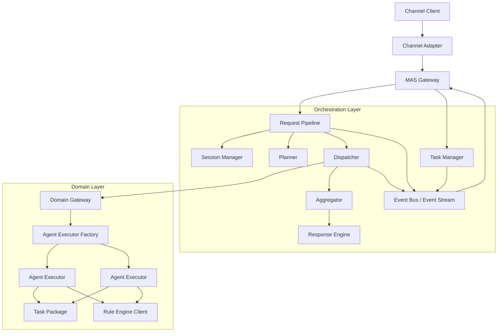
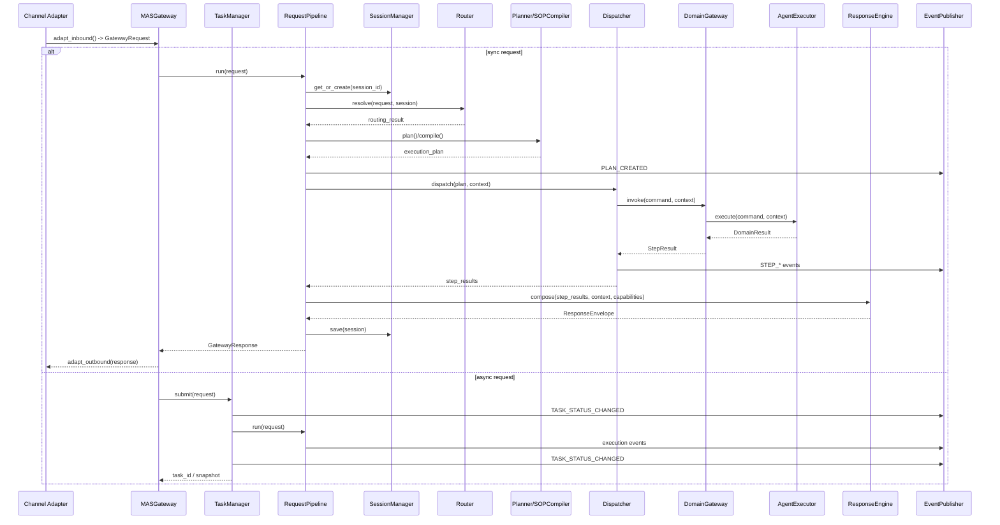

# Agentic BFF SDK 重构方案与接口草案

## 1. 文档目标
### 1.1 SDK整体目标
封装"渠道请求 -> 会话管理 -> 意图识别 -> 计划生成 -> 多领域执行 -> 聚合决策 -> 富媒体响应"功能，提供一个可嵌入Python服务的智能编排内核

本文档基于现有需求规格和详细设计，给出一版面向 Python SDK 落地的重构方案。目标是：

- 满足原有需求文档中的能力边界与验收标准
- 收敛职责边界，降低组件耦合度
- 提供可演进、可测试、可扩展的 Python SDK 接口草案
- 减少核心协议中的 `Any` 和无约束 `Dict`
- 为后续接入真实领域任务包、规则引擎、异步任务和多渠道适配打下稳定基础

本文档不直接替代原始需求文档，而是作为面向实现阶段的重构设计基线。

### 1.2 SDK 接收什么

核心入口接收 GatewayRequest：

GatewayRequest(
    user_input="帮我查询客户张三的基金持仓并生成调整建议",
    session_id="session_001",
    channel_id="web",
    metadata={
        "user_id": "u_123",
        "tenant_id": "t_001",
    },
)

主要输入包括：

- user_input: 用户自然语言输入
- session_id: 会话 ID，用于多轮上下文
- channel_id: 渠道 ID，用于适配不同前端能力
- metadata: 业务元数据，比如用户 ID、租户 ID、权限上下文、渠道能力补充信息
- 异步模式下还可以传 priority

### 1.3 SDK 输出什么

同步请求输出 GatewayResponse，里面核心是 ResponseEnvelope：

GatewayResponse(
    session_id="session_001",
    request_id="req_abc",
    is_async=False,
    content=ResponseEnvelope(
        text="客户张三当前基金持仓偏权益类，建议降低单一行业基金占比。",
        cards=[
            Card(
                card_type="table",
                title="基金持仓概览",
                body={...},
            ),
            Card(
                card_type="confirmation",
                title="是否生成调仓方案",
                body={...},
                actions=[...],
            ),
        ],
        metadata={
            "partial": False,
            "compliance_flags": [],
        },
    ),
    error=None,
)

输出包括：

- text: 可直接展示的自然语言结果
- cards: 前端可渲染的结构化卡片，比如文本、表格、图表、确认按钮
- metadata: 执行状态、部分结果标识、合规标记等
- error: 标准错误响应
- task_id: 异步任务 ID
- is_async: 是否异步响应

异步请求会先返回 task_id：

task_id = await sdk.submit_task(request, priority=1)
snapshot = await sdk.get_task(task_id)
## 2. 设计原则

### 2.1 单一职责

每个核心组件只负责一类能力：

- `MASGateway`: 对外统一入口
- `RequestPipeline`: 单次请求编排
- `TaskManager`: 异步任务生命周期管理
- `SessionStore` / `SessionManager`: 会话状态与记忆管理
- `Planner`: 计划生成
- `Dispatcher`: 计划执行
- `DomainGateway`: 领域路由
- `AgentExecutor`: 领域内部执行
- `ResponseEngine`: 响应决策、文案综合与卡片生成

### 2.2 显式状态作用域

严格区分三类状态：

- `session scope`: 长期会话信息、话题、摘要、用户画像
- `request/task scope`: 单次请求或任务执行上下文
- `step scope`: 单个计划步骤的输入、输出和临时产物

### 2.3 一个统一执行 IR

无论是 LLM 规划还是 SOP 模板编排，最终都收敛到统一的 `ExecutionPlan` 中间表示，不再维护两套执行模型。

### 2.4 强类型优先

对外公开接口、配置模型、执行协议使用清晰的类型定义和 Pydantic 模型，避免核心链路大量使用 `Any`。

### 2.5 事件驱动优先

同步执行、流式结果、异步任务回调、审计日志共享统一的事件模型，避免各组件自行发明状态通知格式。

### 2.6 Python SDK 开发规范

本方案遵循以下 Python SDK 规范：

- Python 3.10+ 类型注解完整
- 对外 API 使用抽象基类或 Protocol 明确契约
- Pydantic 模型使用 `Field(default_factory=...)` 避免可变默认值
- 异步接口默认显式 `async`
- 公共异常体系稳定、可预期
- 模块职责单一，公共导出集中到 `__init__.py`

## 3. 重构后的总体架构

### 3.1 分层结构



### 3.2 运行时交互架构图



### 3.3 模块收敛建议

为避免模块数量膨胀，建议区分“职责解耦”和“源码文件拆分”：

- 逻辑职责可以分层，但不必把每个辅助对象都提升为独立顶层模块
- 对外稳定源码模块建议控制在 12 到 16 个之间

建议合并或内聚处理如下：

1. `decision.py`、`synthesis.py`、`cards.py` 合并为 `response.py`
   原因：三者都属于响应后处理链路，通常连续出现，单独拆文件会增加横切复杂度。
2. `CallbackNotifier` 不单独成模块，内聚到 `tasks.py`
   原因：仅服务异步任务通知。
3. `TopicManager`、`DialogCompressor` 不单独成模块，内聚到 `session.py`
   原因：它们是 `SessionManager` 的内部策略对象。
4. `PlanValidator` 不单独成模块，内聚到 `planning.py`
   原因：只服务执行计划生成与校验。
5. `StatusTracker`、`AsyncioRuntime`、`GraphRuntimeAdapter` 不单独成模块，内聚到 `dispatch.py`
   原因：都属于调度运行时实现细节。
6. `RuleMetadataCache`、`RuleResultCache` 不单独成模块，内聚到 `rules.py`
   原因：缓存策略与规则引擎客户端强耦合。
7. `ToolRegistry`、`ToolInputValidator` 不单独成模块，内聚到 `agent_executor.py`
   原因：它们只是执行器的内部支撑组件。

不建议合并的模块：

- `gateway.py`
- `pipeline.py`
- `tasks.py`
- `session.py`
- `router.py`
- `planning.py`
- `dispatch.py`
- `domain.py`
- `agent_executor.py`
- `rules.py`
- `events.py`
- `models.py`
- `config.py`
- `errors.py`

### 3.4 核心改动摘要

1. `MASGateway` 仅保留入口职责，不再承担全部编排细节。
2. `RequestPipeline` 负责同步请求主链路。
3. `TaskManager` 负责异步任务排队、状态查询、回调通知和重试。
4. `Planner` 和 `SOPCompiler` 统一输出 `ExecutionPlan`。
5. `Dispatcher` 输出事件流和最终结果，不直接绑死下游聚合方式。
6. `DomainGateway` 只做领域路由和协议转换，不再直接吞并领域执行语义。
7. `AgentExecutor` 成为真实的领域执行核心。
8. `RuleEngineClient` 从 `DomainGateway` 中拆出，避免缓存和调用职责混杂。
9. 响应后处理链路收敛为 `ResponseEngine`，降低模块碎片化。

## 4. 对应 10 个优化项的重构方案

## 4.1 优化项一：拆分 MASGateway 职责

### 问题

当前网关同时承担：

- 请求校验
- 会话恢复
- 同步编排
- 异步任务管理
- 回调
- 插件注册

这会导致入口组件膨胀，测试粒度过粗。

### 重构方案

拆分为以下组件：

- `MASGateway`: 统一入口、参数校验、渠道适配装配
- `RequestPipeline`: 处理单次同步请求
- `TaskManager`: 管理异步任务
- `CallbackNotifier`: 作为 `TaskManager` 内部组件发送 Webhook / MQ 回调
- `PluginRegistry`: 插件注册与发现

### 接口草案

```python
from abc import ABC, abstractmethod
from typing import Optional

from pydantic import BaseModel, Field


class GatewayRequest(BaseModel):
    user_input: str
    session_id: str
    channel_id: str
    metadata: dict[str, str | int | float | bool] = Field(default_factory=dict)
    trace_id: Optional[str] = None


class GatewayResponse(BaseModel):
    session_id: str
    request_id: str
    content: "ResponseEnvelope | None" = None
    error: "ErrorResponse | None" = None
    task_id: str | None = None
    is_async: bool = False


class MASGateway(ABC):
    @abstractmethod
    async def handle_request(self, request: GatewayRequest) -> GatewayResponse:
        ...

    @abstractmethod
    async def submit_task(
        self,
        request: GatewayRequest,
        *,
        priority: int = 0,
    ) -> str:
        ...

    @abstractmethod
    async def get_task(self, task_id: str) -> "TaskStateSnapshot":
        ...
```

```python
class RequestPipeline(ABC):
    @abstractmethod
    async def run(self, request: GatewayRequest) -> GatewayResponse:
        ...


class TaskManager(ABC):
    @abstractmethod
    async def submit(
        self,
        request: GatewayRequest,
        *,
        priority: int = 0,
    ) -> str:
        ...

    @abstractmethod
    async def get_snapshot(self, task_id: str) -> "TaskStateSnapshot":
        ...

    @abstractmethod
    async def retry(self, task_id: str) -> bool:
        ...
```

## 4.2 优化项二：统一 Planner 与 SOP Runner 的执行模型

### 问题

当前设计中：

- `IMCPlanner` 生成计划
- `BatchSOPRunner` 也在组织执行

两者存在重复的“流程定义能力”。

### 重构方案

收敛为统一执行 IR：

- `Planner`: 根据意图和上下文生成 `ExecutionPlan`
- `SOPCompiler`: 根据 SOP 模板生成 `ExecutionPlan`
- `ExecutionPlan`: 唯一执行输入
- `Dispatcher`: 唯一执行引擎

### 接口草案

```python
from abc import ABC, abstractmethod
from enum import Enum
from typing import Literal

from pydantic import BaseModel, Field


class PlanSource(str, Enum):
    INTENT = "intent"
    SOP = "sop"


class StepKind(str, Enum):
    DOMAIN_CALL = "domain_call"
    RULE_EVAL = "rule_eval"
    REACT_AGENT = "react_agent"
    HUMAN_CONFIRM = "human_confirm"
    KNOWLEDGE_QUERY = "knowledge_query"


class StepReference(BaseModel):
    step_id: str


class ParameterBinding(BaseModel):
    target_field: str
    source: Literal["literal", "session", "blackboard", "step_output", "user_input"]
    value: str | int | float | bool | None = None
    expr: str | None = None


class ExecutionStep(BaseModel):
    step_id: str
    kind: StepKind
    domain: str | None = None
    action: str | None = None
    description: str
    bindings: list[ParameterBinding] = Field(default_factory=list)
    dependencies: list[str] = Field(default_factory=list)
    timeout_seconds: float | None = None
    retryable: bool = True
    optional: bool = False


class ExecutionPlan(BaseModel):
    plan_id: str
    source: PlanSource
    intent_name: str
    steps: list[ExecutionStep]
    metadata: dict[str, str] = Field(default_factory=dict)


class Planner(ABC):
    @abstractmethod
    async def plan(
        self,
        intent: "ResolvedIntent",
        context: "RequestContext",
    ) -> ExecutionPlan:
        ...


class SOPCompiler(ABC):
    @abstractmethod
    async def compile(
        self,
        sop_id: str,
        context: "RequestContext",
    ) -> ExecutionPlan:
        ...
```

## 4.3 优化项三：理顺 DomainGateway、AgentExecutor、TaskPackage 的关系

### 问题

当前三层职责有交叉。若 `DomainGateway` 直接调用 `TaskPackage.execute()`，则 `AgentExecutor` 很容易失去存在意义。

### 重构方案

明确领域执行链路：

1. `Dispatcher` 调用 `DomainGateway`
2. `DomainGateway` 根据 `domain` 找到 `TaskPackage`
3. `TaskPackage` 提供能力声明和 executor 配置
4. `AgentExecutorFactory` 基于 `TaskPackage` 构建对应 `AgentExecutor`
5. `AgentExecutor` 负责工具推理、规则调用、黑板读写

### 接口草案

```python
from abc import ABC, abstractmethod
from typing import Protocol

from pydantic import BaseModel, Field


class DomainCommand(BaseModel):
    request_id: str
    session_id: str
    step_id: str
    domain: str
    action: str
    payload: dict[str, object] = Field(default_factory=dict)


class DomainResult(BaseModel):
    request_id: str
    step_id: str
    domain: str
    success: bool
    output: dict[str, object] = Field(default_factory=dict)
    error_code: str | None = None
    error_message: str | None = None


class TaskPackage(Protocol):
    name: str
    domain: str

    def get_tools(self) -> list["ToolSpec"]:
        ...

    def get_executor_config(self) -> "AgentExecutorConfig":
        ...


class DomainGateway(ABC):
    @abstractmethod
    def register_task_package(self, package: TaskPackage) -> None:
        ...

    @abstractmethod
    async def invoke(
        self,
        command: DomainCommand,
        context: "ExecutionContext",
    ) -> DomainResult:
        ...


class AgentExecutor(ABC):
    @abstractmethod
    async def execute(
        self,
        command: DomainCommand,
        context: "ExecutionContext",
    ) -> DomainResult:
        ...


class AgentExecutorFactory(ABC):
    @abstractmethod
    def create(self, package: TaskPackage) -> AgentExecutor:
        ...
```

## 4.4 优化项四：强化类型系统与模型约束

### 问题

核心模型中存在大量：

- `Any`
- `Dict[str, Any]`
- 字符串状态值
- 可变默认值

这会降低 SDK 稳定性，也不利于 IDE 和静态检查。

### 重构方案

1. 统一使用枚举表示状态
2. 使用 `Field(default_factory=...)`
3. 对关键模型添加领域约束校验
4. 为卡片输出、领域响应、确认动作定义稳定 schema

### 接口草案

```python
from enum import Enum

from pydantic import BaseModel, Field, field_validator


class TopicStatus(str, Enum):
    ACTIVE = "active"
    SUSPENDED = "suspended"
    CLOSED = "closed"


class Topic(BaseModel):
    topic_id: str
    name: str
    status: TopicStatus
    metadata: dict[str, str] = Field(default_factory=dict)


class SessionMessage(BaseModel):
    role: str
    content: str
    timestamp: float


class SessionState(BaseModel):
    session_id: str
    dialog_history: list[SessionMessage] = Field(default_factory=list)
    user_profile_summary: str | None = None
    active_topics: list[Topic] = Field(default_factory=list)
    created_at: float
    last_active_at: float


class ExecutionPlan(BaseModel):
    plan_id: str
    source: PlanSource
    intent_name: str
    steps: list[ExecutionStep]

    @field_validator("steps")
    @classmethod
    def validate_steps(cls, steps: list[ExecutionStep]) -> list[ExecutionStep]:
        step_ids = [step.step_id for step in steps]
        if len(step_ids) != len(set(step_ids)):
            raise ValueError("Duplicate step_id found in execution plan.")
        known = set(step_ids)
        for step in steps:
            missing = [dep for dep in step.dependencies if dep not in known]
            if missing:
                raise ValueError(f"Missing dependencies for {step.step_id}: {missing}")
        return steps
```

## 4.5 优化项五：统一 LangGraph 与 asyncio 的定位

### 问题

设计里把 LangGraph 定义为核心依赖，但当前实际执行主链路更像纯 `asyncio` 调度。如果这点不统一，会导致实现目标持续摇摆。

### 重构方案

采用“双层定位”：

- 第一阶段：SDK 核心编排层基于 `asyncio` + 明确事件模型落地，保证轻量和可测
- 第二阶段：通过 `GraphRuntimeAdapter` 提供 LangGraph 兼容运行时，作为高级能力扩展

这样既满足需求中的 DAG / 状态管理要求，也避免初期被框架特性反向绑架。

### 接口草案

```python
from abc import ABC, abstractmethod


class ExecutionRuntime(ABC):
    @abstractmethod
    async def run(
        self,
        plan: ExecutionPlan,
        context: "ExecutionContext",
    ) -> "ExecutionReport":
        ...


class AsyncioRuntime(ExecutionRuntime):
    async def run(
        self,
        plan: ExecutionPlan,
        context: "ExecutionContext",
    ) -> "ExecutionReport":
        ...


class GraphRuntimeAdapter(ExecutionRuntime):
    async def run(
        self,
        plan: ExecutionPlan,
        context: "ExecutionContext",
    ) -> "ExecutionReport":
        ...
```

## 4.6 优化项六：引入统一事件流模型

### 问题

当前“流式合并、异步回调、执行状态变更、审计记录”没有共用协议。

### 重构方案

定义统一事件模型 `ExecutionEvent`，用于：

- 同步流式输出
- 异步任务状态通知
- 审计日志记录
- 调试和追踪

### 接口草案

```python
from enum import Enum

from pydantic import BaseModel, Field


class EventType(str, Enum):
    REQUEST_ACCEPTED = "request_accepted"
    PLAN_CREATED = "plan_created"
    STEP_STARTED = "step_started"
    STEP_OUTPUT = "step_output"
    STEP_COMPLETED = "step_completed"
    STEP_FAILED = "step_failed"
    TASK_STATUS_CHANGED = "task_status_changed"
    RESPONSE_READY = "response_ready"


class ExecutionEvent(BaseModel):
    event_id: str
    event_type: EventType
    request_id: str
    task_id: str | None = None
    session_id: str
    step_id: str | None = None
    payload: dict[str, object] = Field(default_factory=dict)
    created_at: float


class EventPublisher(ABC):
    @abstractmethod
    async def publish(self, event: ExecutionEvent) -> None:
        ...


class EventSubscriber(ABC):
    @abstractmethod
    async def handle(self, event: ExecutionEvent) -> None:
        ...
```

## 4.7 优化项七：明确 Session、Blackboard、Task 状态边界

### 问题

会话状态、共享上下文和异步任务状态容易混用，后续并发和恢复场景风险很高。

### 重构方案

明确定义三个上下文对象：

- `SessionState`: 跨多轮对话持久存在
- `RequestContext`: 单次请求上下文
- `ExecutionContext`: 执行过程共享上下文，持有 blackboard

### 接口草案

```python
from pydantic import BaseModel, Field


class BlackboardEntry(BaseModel):
    key: str
    value: object
    expires_at: float | None = None
    version: int = 1


class Blackboard(ABC):
    @abstractmethod
    async def get(self, key: str) -> BlackboardEntry | None:
        ...

    @abstractmethod
    async def set(self, entry: BlackboardEntry) -> None:
        ...

    @abstractmethod
    async def delete(self, key: str) -> bool:
        ...


class RequestContext(BaseModel):
    request_id: str
    session_id: str
    channel_id: str
    user_input: str
    metadata: dict[str, object] = Field(default_factory=dict)


class ExecutionContext(BaseModel):
    request: RequestContext
    session: SessionState
    blackboard_keys: list[str] = Field(default_factory=list)
```

### 会话相关接口草案

```python
class SessionStore(ABC):
    @abstractmethod
    async def load(self, session_id: str) -> SessionState | None:
        ...

    @abstractmethod
    async def save(self, state: SessionState) -> None:
        ...

    @abstractmethod
    async def delete(self, session_id: str) -> None:
        ...


class SessionManager(ABC):
    @abstractmethod
    async def get_or_create(self, session_id: str) -> SessionState:
        ...

    @abstractmethod
    async def append_message(
        self,
        session_id: str,
        message: SessionMessage,
    ) -> SessionState:
        ...

    @abstractmethod
    async def compress_history(self, session_id: str) -> SessionState:
        ...
```

## 4.8 优化项八：拆分规则引擎客户端与缓存语义

### 问题

规则执行结果缓存和规则元数据缓存不应混为一体。

### 重构方案

引入独立 `RuleEngineClient`：

- `get_rule_metadata()`: 缓存元数据
- `evaluate()`: 执行规则
- 若需要结果缓存，显式由 `RuleResultCache` 管理，key 包含参数摘要和规则版本

### 接口草案

```python
from pydantic import BaseModel, Field


class RuleMetadata(BaseModel):
    rule_set_id: str
    version: str
    input_schema: dict[str, object] = Field(default_factory=dict)
    output_schema: dict[str, object] = Field(default_factory=dict)


class RuleEvaluationRequest(BaseModel):
    rule_set_id: str
    version: str | None = None
    inputs: dict[str, object] = Field(default_factory=dict)


class RuleEvaluationResult(BaseModel):
    rule_set_id: str
    version: str
    outputs: dict[str, object] = Field(default_factory=dict)
    hit_rules: list[str] = Field(default_factory=list)


class RuleEngineClient(ABC):
    @abstractmethod
    async def get_rule_metadata(self, rule_set_id: str) -> RuleMetadata:
        ...

    @abstractmethod
    async def evaluate(
        self,
        request: RuleEvaluationRequest,
    ) -> RuleEvaluationResult:
        ...
```

## 4.9 优化项九：把综合决策从“文本生成”中分离

### 问题

综合模块如果只做 LLM 文本拼接，无法保证：

- 是否需要用户确认
- 是否满足合规
- 是否存在关键字段缺失

### 重构方案

将响应后处理统一收敛到 `ResponseEngine` 模块中，模块内部包含三层职责：

- `DecisionEngine`: 结构化决策
- `Synthesizer`: 自然语言表达
- `CardGenerator`: 富媒体生成

这样既能把合规和业务决策从文案生成中剥离出来，也能避免源码层过度拆分。

### 接口草案

```python
from enum import Enum

from pydantic import BaseModel, Field


class DecisionStatus(str, Enum):
    READY = "ready"
    NEEDS_CONFIRMATION = "needs_confirmation"
    PARTIAL = "partial"
    BLOCKED = "blocked"


class ConfirmationAction(BaseModel):
    action_id: str
    label: str
    summary: str


class DecisionOutcome(BaseModel):
    status: DecisionStatus
    summary: str
    structured_payload: dict[str, object] = Field(default_factory=dict)
    confirmation_actions: list[ConfirmationAction] = Field(default_factory=list)
    compliance_flags: list[str] = Field(default_factory=list)


class DecisionEngine(ABC):
    @abstractmethod
    async def decide(
        self,
        aggregated: "AggregatedResult",
        context: ExecutionContext,
    ) -> DecisionOutcome:
        ...


class Synthesizer(ABC):
    @abstractmethod
    async def synthesize(
        self,
        decision: DecisionOutcome,
        context: ExecutionContext,
    ) -> "SynthesisResult":
        ...
```

## 4.10 优化项十：标准化多渠道接入与能力协商

### 问题

如果渠道能力只放在 `metadata`，后续会出现：

- 渠道适配器行为不一致
- 卡片 schema 不稳定
- 版本升级困难

### 重构方案

引入三层渠道协议：

- `ChannelAdapter`: 请求和响应适配
- `ChannelCapabilities`: 强类型能力描述
- `ResponseEnvelope`: 渠道无关输出

### 接口草案

```python
from pydantic import BaseModel, Field


class ChannelCapabilities(BaseModel):
    supports_markdown: bool = True
    supports_table_card: bool = True
    supports_chart_card: bool = False
    supports_action_card: bool = True
    max_card_count: int = 5
    schema_version: str = "1.0"


class ResponseEnvelope(BaseModel):
    text: str
    cards: list["Card"] = Field(default_factory=list)
    metadata: dict[str, object] = Field(default_factory=dict)


class ChannelAdapter(ABC):
    @abstractmethod
    async def adapt_inbound(self, payload: object) -> GatewayRequest:
        ...

    @abstractmethod
    async def adapt_outbound(
        self,
        response: ResponseEnvelope,
    ) -> object:
        ...

    @abstractmethod
    def get_capabilities(self) -> ChannelCapabilities:
        ...
```

## 5. 重构后的核心模型草案

## 5.1 请求与响应模型

```python
from enum import Enum

from pydantic import BaseModel, Field


class ErrorCode(str, Enum):
    INVALID_REQUEST = "invalid_request"
    SESSION_NOT_FOUND = "session_not_found"
    INTENT_NOT_RECOGNIZED = "intent_not_recognized"
    PLAN_VALIDATION_FAILED = "plan_validation_failed"
    DOMAIN_UNAVAILABLE = "domain_unavailable"
    RULE_ENGINE_ERROR = "rule_engine_error"
    INTERNAL_ERROR = "internal_error"


class ErrorResponse(BaseModel):
    code: ErrorCode
    message: str
    details: dict[str, object] = Field(default_factory=dict)
```

## 5.2 任务模型

```python
class TaskStatus(str, Enum):
    PENDING = "pending"
    RUNNING = "running"
    COMPLETED = "completed"
    FAILED = "failed"
    CANCELLED = "cancelled"


class TaskStateSnapshot(BaseModel):
    task_id: str
    status: TaskStatus
    request_id: str
    session_id: str
    progress_percent: float = 0.0
    latest_event_type: str | None = None
    error: ErrorResponse | None = None
    result: ResponseEnvelope | None = None
```

## 5.3 聚合模型

```python
class StepStatus(str, Enum):
    PENDING = "pending"
    RUNNING = "running"
    COMPLETED = "completed"
    FAILED = "failed"
    TIMEOUT = "timeout"
    SKIPPED = "skipped"


class StepResult(BaseModel):
    step_id: str
    status: StepStatus
    output: dict[str, object] = Field(default_factory=dict)
    error_message: str | None = None
    duration_ms: float = 0.0


class AggregatedResult(BaseModel):
    results: list[StepResult] = Field(default_factory=list)
    missing_steps: list[str] = Field(default_factory=list)
    failed_steps: list[str] = Field(default_factory=list)
    is_partial: bool = False
```

## 5.4 卡片模型

```python
class CardType(str, Enum):
    TEXT = "text"
    TABLE = "table"
    CHART = "chart"
    ACTION = "action"
    CONFIRMATION = "confirmation"


class CardAction(BaseModel):
    action_id: str
    label: str
    payload: dict[str, object] = Field(default_factory=dict)


class Card(BaseModel):
    card_type: CardType
    title: str | None = None
    body: dict[str, object] = Field(default_factory=dict)
    actions: list[CardAction] = Field(default_factory=list)
    schema_version: str = "1.0"
```

## 6. 重构后的主执行流程

### 6.1 同步请求

1. `ChannelAdapter.adapt_inbound()`
2. `MASGateway.handle_request()`
3. `SessionManager.get_or_create()`
4. `Router.resolve()`
5. `Planner.plan()` 或 `SOPCompiler.compile()`
6. `ExecutionPlan` 校验
7. `Dispatcher.dispatch()`
8. `Aggregator.aggregate()`
9. `DecisionEngine.decide()`
10. `Synthesizer.synthesize()`
11. `CardGenerator.generate()`
12. `ChannelAdapter.adapt_outbound()`

### 6.2 异步请求

1. `MASGateway.submit_task()`
2. `TaskManager.submit()`
3. 返回 `task_id`
4. 后台任务运行同样的 `RequestPipeline`
5. 过程事件统一发送给 `EventPublisher`
6. `CallbackNotifier` 根据事件触发 Webhook 或 MQ 通知

## 7. 配置模型重构建议

### 7.1 配置层级

建议配置分层如下：

- `SDKConfig`
- `RuntimeConfig`
- `ChannelConfig`
- `DomainConfig`
- `RuleEngineConfig`
- `ObservabilityConfig`

### 7.2 接口草案

```python
from pydantic import BaseModel, Field


class RuntimeConfig(BaseModel):
    session_idle_timeout_seconds: int = 1800
    plan_generation_timeout_seconds: float = 30.0
    step_execution_timeout_seconds: float = 60.0
    fan_in_wait_timeout_seconds: float = 30.0
    max_cross_llm_loops: int = 2


class RuleEngineConfig(BaseModel):
    base_url: str | None = None
    timeout_seconds: float = 10.0
    metadata_cache_ttl_seconds: int = 300
    result_cache_enabled: bool = False


class DomainConfig(BaseModel):
    domain: str
    package_class: str
    timeout_seconds: float = 30.0


class ChannelConfig(BaseModel):
    channel_id: str
    adapter_class: str
    capabilities: ChannelCapabilities = Field(default_factory=ChannelCapabilities)


class SDKConfig(BaseModel):
    runtime: RuntimeConfig = Field(default_factory=RuntimeConfig)
    rule_engine: RuleEngineConfig = Field(default_factory=RuleEngineConfig)
    channels: list[ChannelConfig] = Field(default_factory=list)
    domains: list[DomainConfig] = Field(default_factory=list)
```

## 8. 推荐的模块划分

建议将源码模块按职责收敛为：

- `gateway.py`: `MASGateway`
- `pipeline.py`: `RequestPipeline`
- `tasks.py`: `TaskManager`, `TaskStateSnapshot`
- `session.py`: `SessionManager`, `SessionStore`, `SessionState`
- `blackboard.py`: `Blackboard`
- `router.py`: `Router`, `ResolvedIntent`
- `planning.py`: `Planner`, `SOPCompiler`, `ExecutionPlan`
- `dispatch.py`: `Dispatcher`, `ExecutionRuntime`
- `domain.py`: `DomainGateway`, `TaskPackage`, `DomainCommand`, `DomainResult`
- `agent_executor.py`: `AgentExecutor`, `AgentExecutorFactory`
- `rules.py`: `RuleEngineClient`
- `aggregation.py`: `Aggregator`, `AggregatedResult`
- `response.py`: `DecisionEngine`, `Synthesizer`, `CardGenerator`, `DecisionOutcome`, `ResponseEnvelope`
- `channels.py`: `ChannelAdapter`, `ChannelCapabilities`
- `events.py`: `ExecutionEvent`, `EventPublisher`
- `config.py`: Pydantic 配置模型
- `errors.py`: 稳定异常和错误码

## 9. 与原需求的对应关系

### 需求覆盖说明

- Requirement 1, 2, 11, 12 由 `MASGateway + SessionManager + TaskManager + ChannelAdapter` 覆盖
- Requirement 3 由 `Router` 覆盖
- Requirement 4, 5, 6 由 `Planner/SOPCompiler + Dispatcher + ExecutionRuntime` 覆盖
- Requirement 7, 8, 13 由 `DomainGateway + AgentExecutor + RuleEngineClient` 覆盖
- Requirement 9 由 `Aggregator + ResponseEngine` 覆盖
- Requirement 10 由 `ResponseEngine + ChannelCapabilities` 覆盖

### 关键说明

原需求中的能力没有被删除，而是通过更清晰的结构被重组：

- 保留异步任务与回调
- 保留会话与话题管理
- 保留 LLM 规划和 ReAct 执行
- 保留规则引擎集成
- 保留多渠道富媒体输出
- 保留 DAG 并发与部分结果处理

## 10. 推荐实施顺序

### 第一阶段：协议收敛

- 重构核心模型
- 清理可变默认值
- 引入 `ExecutionPlan` 新协议
- 引入 `ResponseEnvelope` 和 `ExecutionEvent`

### 第二阶段：职责拆分

- 从 `MASGateway` 拆出 `RequestPipeline` 和 `TaskManager`
- 从 `DomainGateway` 拆出 `RuleEngineClient`
- 引入 `DecisionEngine`

### 第三阶段：执行链路重构

- 用统一 `ExecutionPlan` 替换原先的 Planner/SOP 双路径
- 让 `AgentExecutor` 真正进入主链路
- 接入统一事件发布

### 第四阶段：高级能力增强

- 增加 LangGraph 运行时适配器
- 增强流式聚合
- 增强审计和可观测性

## 11. 结论

本重构方案的核心不是增加更多组件，而是把已有需求拆解到清晰、稳定、可测试的边界内。经过重构后，SDK 将具备以下优势：

- 入口清晰，避免单体网关膨胀
- 执行路径统一，减少 SOP 与计划编排重复
- 领域执行职责明确，`AgentExecutor` 不再虚化
- 类型约束更强，更符合 Python SDK 开发规范
- 事件模型统一，更易支持流式、回调、审计
- 多渠道协议稳定，便于版本演进

建议以本文档作为下一轮详细设计和重构实施的基线。
