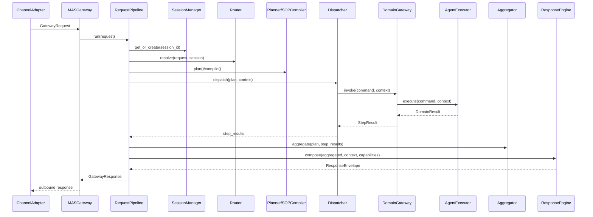

# SDK 总体形态

> 对应新方案：`MASGateway`、`RequestPipeline`、`TaskManager`、`ExecutionPlan`、`ResponseEngine`

## 定位

Agentic BFF SDK 是一个可嵌入 Python 服务的智能业务编排内核。它面向渠道端提供统一入口，内部完成会话管理、意图路由、计划生成、DAG 调度、领域执行、结果聚合、决策综合和富媒体响应生成。

SDK 不绑定具体 Web 框架，也不绑定具体业务系统。业务方通过注册领域任务包、渠道适配器、规则引擎客户端和 LLM 组件来扩展能力。

## 运行时主链路



## SDK 接收内容

核心入口接收 `GatewayRequest`：

```python
GatewayRequest(
    user_input="查询客户张三的基金持仓并生成调整建议",
    session_id="session_001",
    channel_id="web",
    metadata={"user_id": "u_001", "tenant_id": "t_001"},
)
```

字段说明：

- `user_input`: 用户自然语言输入
- `session_id`: 会话标识，用于多轮上下文
- `channel_id`: 渠道标识，用于能力协商和响应适配
- `metadata`: 权限、租户、用户、追踪等业务元数据
- `trace_id`: 可选链路追踪标识

## SDK 输出内容

同步请求输出 `GatewayResponse`，核心内容是 `ResponseEnvelope`：

```python
GatewayResponse(
    session_id="session_001",
    request_id="req_001",
    is_async=False,
    content=ResponseEnvelope(
        text="客户当前持仓偏权益类，建议降低单一行业基金占比。",
        cards=[...],
        metadata={"partial": False, "compliance_flags": []},
    ),
    error=None,
)
```

输出内容包括：

- `text`: 自然语言响应
- `cards`: 前端可渲染的结构化卡片
- `metadata`: 部分结果、合规标记、执行摘要等
- `error`: 标准错误响应
- `task_id`: 异步任务标识
- `is_async`: 是否为异步响应

## 同步与异步

同步请求：

```python
response = await sdk.handle_request(request)
```

异步请求：

```python
task_id = await sdk.submit_task(request, priority=1)
snapshot = await sdk.get_task(task_id)
```

异步任务由 `TaskManager` 管理，过程状态通过 `ExecutionEvent` 更新，可接入 Webhook、消息队列或日志订阅器。

## 新方案中的核心模块

- `gateway.py`: 对外统一入口
- `pipeline.py`: 单次请求编排
- `tasks.py`: 异步任务管理
- `session.py`: 会话与话题管理
- `blackboard.py`: 执行共享状态
- `router.py`: 意图识别与澄清
- `planning.py`: LLM 规划和 SOP 编译
- `dispatch.py`: DAG 并发调度
- `domain.py`: 领域路由
- `agent_executor.py`: 领域 Agent 执行
- `rules.py`: 规则引擎客户端
- `aggregation.py`: 结果聚合
- `response.py`: 决策、综合、卡片生成
- `channels.py`: 渠道适配与能力协商
- `events.py`: 事件流
- `config.py`: 配置
- `errors.py`: 错误体系
- `models.py`: 公共数据模型
